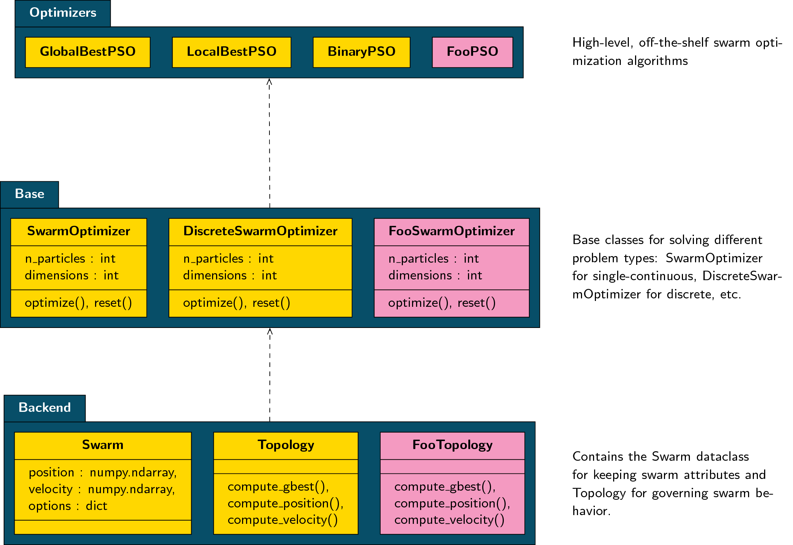

===============================
Understanding the PySwarms API
===============================

There are three main layers in PySwarms' main API:

* **Optimizers**: includes all off-the-shelf implementations of most swarm intelligence algorithms
* **Base**: base API where most Optimizer implementations were based upon. Each Base module is designed with respect to the problem domain they're trying to solve: single-continuous, discrete, *(in the future)* multiobjective, constrained, etc.
* **Backend**: backend API that exposes common operations for any swarm algorithm such as swarm initialization, global best computation, nearest neighbor search, etc.

You can find the structure of the main PySwarms API in the figure below:

When contributing to PySwarms, you can start off with any of the Layers
specified above. Right now, we would really appreciate contributions from the
Base Layer below. Some of which that need some dedicated contributions:

* ConstrainedOptimizer (in Base Layer)
* MultiObjectiveOptimizer (in Base Layer)
* Different Topologies (in Backend Layer)

If we can have a strong set of native APIs for the low-level layers, it will
then be very easy to implement different swarm algorithms. Of course, for
your personal needs, you can simply inherit any of the classes in PySwarms
and modify them according to your own specifications.

Remember, when you want to implement your own Optimizer, there is no need
to go from Backend to Optimizers layer. Instead, you can just import the
:class:`pyswarms.backend.swarms.Swarm` class and the classes in the :mod:`pyswarms.backend.topology` module.