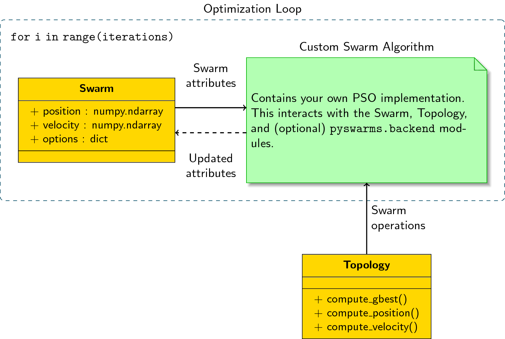

==================================
Writing your own optimization loop
==================================

The backend module provides a lot of helper methods for you
to customize your swarm implementation. This gives you a black-box
approach by requiring you to write your own optimization-loop.

There are two important components for any swarm implementation:

* The **Swarm** class, containing all important attributes and properties of the swarm; and
* The **Topology** class, governing how the swarm will behave during optimization.

The main idea is that for every iteration, you interact with the Swarm class
using the methods found in the Topology class (or optionally, in
:mod:`pyswarms.backend.operators`). You continuously take the attributes
present in Swarm, and update them using the operations your algorithm
requires. Together with some methods found in
:mod:`pyswarms.backend.generators` and :mod:`pyswarms.backend.operators`, it
is possible to create different kinds of swarm implementations.

The Swarm Class
----------------

:class:`pyswarms.backend.swarms.Swarm` acts as a data-class that keeps all
necessary attributes in a given swarm implementation. You initialize it by
providing the initial position and velocity matrices. For the current
iteration, you can obtain the following information from the class:

* :code:`position`: the current position-matrix of the swarm. Each row is a particle and each column is its position on a given dimension.
* :code:`velocity`: the current velocity-matrix of the swarm. Each row is a particle and each column is its velocity on a given dimension.
* :code:`pbest_pos`: the personal best position of each particle that corresponds to the personal best cost.
* :code:`pbest_cost`: the personal best fitness attained by the particle since the first iteration.
* :code:`best_pos`: the best position found by the swarm that corresponds to the best cost.
* :code:`best_cost`: the best fitness found by the swarm.
* :code:`options`: additional options that you can use for your particular needs. As an example, the :code:`GlobalBestPSO` implementation uses this to store the cognitive and social parameters of the swarm.

The Topology Class
-------------------

:mod:`pyswarms.backend.base.topology` houses all operations that you can use
on the Swarm attributes. Currently, the Star and Ring topologies are
implemented, but more topologies will still be done in the future. A Topology
implements three methods governing swarm behavior:

* :code:`compute_gbest`: computes the best particle (both cost and position) given a swarm instance.
* :code:`compute_position`: computes the next position of the swarm given its current position.
* :code:`compute_velocity`: computes the velocity of the swarm given its attributes.

Needless to say, these three methods will differ depending on the topology
present. All these methods take in an instance of the :code:`Swarm` class,
and outputs the necessary matrices. The advantage of using this class is that
it abstracts away all the internals of implementing a swarm algorithm. You
just need to provide the topology, and call its methods right away.