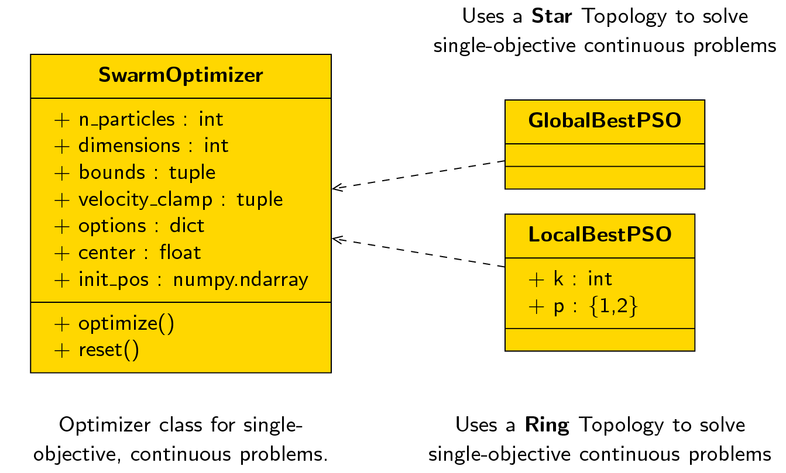

===============================
Contributing your own optimizer
===============================

PySwarms aims to be the go-to library for various PSO implementations, so if you
are a researcher in swarm intelligence or a developer who wants to contribute,
then read on this guide!

As a preliminary, here is a checklist whenever you will implement an optimizer:

* Propose an optimizer

* Write optimizer by inheriting from base classes

* Write a unit test

Proposing an optimizer
----------------------

We wanted to make sure that PySwarms is highly-usable, and thus it is important
that optimizers included in this library are either (1) classic textbook-PSO techniques
or (2) highly-cited, published, optimization algorithms. 

In case you wanted to include your optimization algorithm in this library, please
raise an issue and add a short abstract on what your optimizer does. A link to a
published paper (it's okay if it's behind a paywall) would be really helpful!

Inheriting from base classes
----------------------------

Most optimizers in this library inherit its attributes and methods from a set of built-in
base classes. You can check the existing classes in :mod:`pyswarms.base`. 

For example, if we take the :mod:`pyswarms.base.base_single` class, a base-class for standard single-objective
continuous optimization algorithms such as global-best PSO (:mod:`pyswarms.single.global_best`) and
local-best PSO (:mod:`pyswarms.single.local_best`), we can see that it inherits a set of methods as
seen below:

The required methods can be seen in the base classes, and will raise a :code:`NotImplementedError`
if not called. Additional methods, private or not, can also be added depending on the needs of your
optimizer. 

A short note on keyword arguments
~~~~~~~~~~~~~~~~~~~~~~~~~~~~~~~~~

The role of keyword arguments, or kwargs in short, is to act as a container
for all other parameters needed for the optimizer. You can define these
things in your code, and create assertions to make all of them required.
However, note that in some implementations, required :code:`options` might
include :code:`c1`, :code:`c2`, and :code:`w`. This is the case in
:mod:`pyswarms.base.bases` for instance.

A short note on :code:`assertions()`
~~~~~~~~~~~~~~~~~~~~~~~~~~~~~~~~~~~~

You might notice that in most base classes, an :code:`assertions()` method is
being called. This aims to check if the user-facing input are correct.
Although the method is called "assertions", please make all user-facing
catches as raised Exceptions.

A short note on :code:`__init__.py`
~~~~~~~~~~~~~~~~~~~~~~~~~~~~~~~~~~~

We make sure that everything can be imported when the whole :code:`pyswarms`
library is called. Thus, please make sure to also edit the accompanying
:code:`__init__.py` file in the directory you are working on.

For example, if you write your optimizer class :code:`MyOptimizer` inside a
file called :code:`my_optimizer.py`, and you are working under the
:code:`/single` directory, please update the :code:`__init__.py` like the
following:

.. code-block:: python

    from .global_best import GlobalBestPSO
    from .local_best import LocalBestPSO
    # Add your module
    from .my_optimizer import MyOptimizer

    __all__ = [
        "GlobalBestPSO",
        "LocalBestPSO",
        "MyOptimizer" # Add your class
        ]

This ensures that it will be automatically initialized when the whole library is imported.

Writing unit tests
------------------

Testing is an important element of developing PySwarms and we want
everything to be as smooth as possible. Especially, when working on
the build and integrating new features. In this case, we provide the
:code:`tests` module in the package. For writing the test, we use the
:code:`pytest` module. In case you add a test for your optimizer,
use the same naming conventions that were used in the existing ones.

You can perform separate checks by

.. code-block:: shell

    $ python -m pytest tests.optimizers.<test_myoptimizer>

For more details on running the tests `see here`_.

.. _see here: https://docs.pytest.org/en/latest/usage.html
