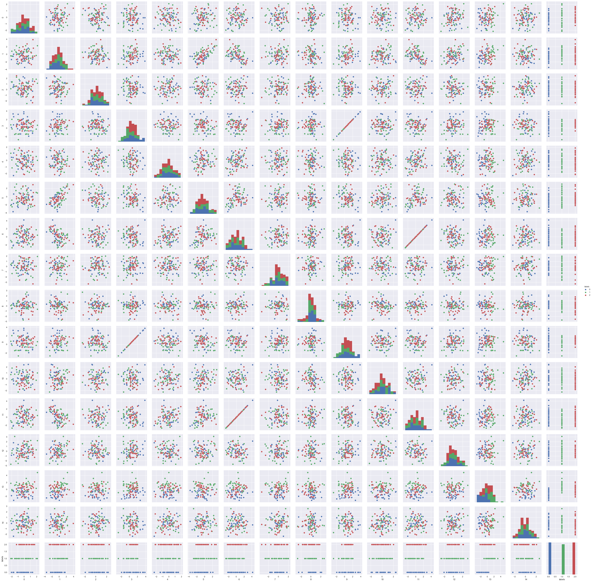

Feature Subset Selection
========================

In this example, we'll be using the optimizer
``pyswarms.discrete.BinaryPSO`` to perform feature subset selection to
improve classifier performance. But before we jump right on to the
coding, let's first explain some relevant concepts:

A short primer on feature selection
-----------------------------------

The idea for feature subset selection is to be able to find the best
features that are suitable to the classification task. We must
understand that not all features are created equal, and some may be more
relevant than others. Thus, if we're given an array of features, how can
we know the most optimal subset? (yup, this is a rhetorical question!)

For a Binary PSO, the position of the particles are expressed in two
terms: ``1`` or ``0`` (or on and off). If we have a particle :math:`x`
on :math:`d`-dimensions, then its position can be defined as:

.. math:: x = [x_1, x_2, x_3, \dots, x_d] ~~~\text{where}~~~ x_i \in {0,1}

In this case, the position of the particle for each dimension can be
seen as a simple matter of on and off.

Feature selection and the objective function
~~~~~~~~~~~~~~~~~~~~~~~~~~~~~~~~~~~~~~~~~~~~

Now, suppose that we're given a dataset with :math:`d` features. What
we'll do is that we're going to *assign each feature as a dimension of a
particle*. Hence, once we've implemented Binary PSO and obtained the
best position, we can then interpret the binary array (as seen in the
equation above) simply as turning a feature on and off.

As an example, suppose we have a dataset with 5 features, and the final
best position of the PSO is:

.. code:: python

    >>> optimizer.best_pos
    np.array([0, 1, 1, 1, 0])
    >>> optimizer.best_cost
    0.00

Then this means that the second, third, and fourth (or first, second,
and third in zero-index) that are turned on are the selected features
for the dataset. We can then train our classifier using only these
features while dropping the others. How do we then define our objective
function? (Yes, another rhetorical question!). We can design our own,
but for now I'll be taking an equation from the works of `Vieira,
Mendoca, Sousa, et al.
(2013) <http://www.sciencedirect.com/science/article/pii/S1568494613001361>`__.

.. math:: f(X) = \alpha(1-P) + (1-\alpha) \left(1 - \dfrac{N_f}{N_t}\right)

Where :math:`\alpha` is a hyperparameter that decides the tradeoff
between the classifier performance :math:`P`, and the size of the
feature subset :math:`N_f` with respect to the total number of features
:math:`N_t`. The classifier performance can be the accuracy, F-score,
precision, and so on.

.. code-block:: python

    # Import modules
    import numpy as np
    import seaborn as sns
    import pandas as pd
    
    # Import PySwarms
    import pyswarms as ps
    
    # Some more magic so that the notebook will reload external python modules;
    # see http://stackoverflow.com/questions/1907993/autoreload-of-modules-in-ipython
    %load_ext autoreload
    %autoreload 2
    %matplotlib inline

Generating a toy dataset using scikit-learn
~~~~~~~~~~~~~~~~~~~~~~~~~~~~~~~~~~~~~~~~~~~

We'll be using ``sklearn.datasets.make_classification`` to generate a
100-sample, 15-dimensional dataset with three classes. We will then plot
the distribution of the features in order to give us a qualitative
assessment of the feature-space.

For our toy dataset, we will be rigging some parameters a bit. Out of
the 15 features, we'll have only 4 that are informative, 1 that are
redundant, and 2 that are repeated. Hopefully, we get to have Binary PSO
select those that are informative, and prune those that are redundant or
repeated.

.. code-block:: python

    from sklearn.datasets import make_classification
    X, y = make_classification(n_samples=100, n_features=15, n_classes=3, 
                               n_informative=4, n_redundant=1, n_repeated=2, 
                               random_state=1)

.. code-block:: python

    # Plot toy dataset per feature
    df = pd.DataFrame(X)
    df['labels'] = pd.Series(y)
    
    sns.pairplot(df, hue='labels');

As we can see, there are some features that causes the two classes to
overlap with one another. These might be features that are better off
unselected. On the other hand, we can see some feature combinations
where the two classes are shown to be clearly separated. These features
can hopefully be retained and selected by the binary PSO algorithm.

We will then use a simple logistic regression technique using
``sklearn.linear_model.LogisticRegression`` to perform classification. A
simple test of accuracy will be used to assess the performance of the
classifier.

Writing the custom-objective function
-------------------------------------

As seen above, we can write our objective function by simply taking the
performance of the classifier (in this case, the accuracy), and the size
of the feature subset divided by the total (that is, divided by 10), to
return an error in the data. We'll now write our custom-objective
function

.. code-block:: python

    from sklearn import linear_model
    
    # Create an instance of the classifier
    classifier = linear_model.LogisticRegression()
    
    # Define objective function
    def f_per_particle(m, alpha):
        """Computes for the objective function per particle
        
        Inputs
        ------
        m : numpy.ndarray
            Binary mask that can be obtained from BinaryPSO, will
            be used to mask features.
        alpha: float (default is 0.5)
            Constant weight for trading-off classifier performance
            and number of features
        
        Returns
        -------
        numpy.ndarray
            Computed objective function
        """
        total_features = 15
        # Get the subset of the features from the binary mask
        if np.count_nonzero(m) == 0:
            X_subset = X
        else:
            X_subset = X[:,m==1]
        # Perform classification and store performance in P
        classifier.fit(X_subset, y)
        P = (classifier.predict(X_subset) == y).mean()
        # Compute for the objective function
        j = (alpha * (1.0 - P) 
            + (1.0 - alpha) * (1 - (X_subset.shape[1] / total_features)))
        
        return j

.. code-block:: python

    def f(x, alpha=0.88):
        """Higher-level method to do classification in the 
        whole swarm.
        
        Inputs
        ------
        x: numpy.ndarray of shape (n_particles, dimensions)
            The swarm that will perform the search
            
        Returns
        -------
        numpy.ndarray of shape (n_particles, )
            The computed loss for each particle
        """
        n_particles = x.shape[0]
        j = [f_per_particle(x[i], alpha) for i in range(n_particles)]
        return np.array(j)
        

Using Binary PSO
----------------

With everything set-up, we can now use Binary PSO to perform feature
selection. For now, we'll be doing a global-best solution by setting the
number of neighbors equal to the number of particles. The
hyperparameters are also set arbitrarily. Moreso, we'll also be setting
the distance metric as 2 (truth is, it's not really relevant because
each particle will see one another).

.. code-block:: python

    # Initialize swarm, arbitrary
    options = {'c1': 0.5, 'c2': 0.5, 'w':0.9, 'k': 30, 'p':2}
    
    # Call instance of PSO
    dimensions = 15 # dimensions should be the number of features
    optimizer.reset()
    optimizer = ps.discrete.BinaryPSO(n_particles=30, dimensions=dimensions, options=options)
    
    # Perform optimization
    cost, pos = optimizer.optimize(f, print_step=100, iters=1000, verbose=2)

.. parsed-literal::

    Iteration 1/1000, cost: 0.2776
    Iteration 101/1000, cost: 0.2792
    Iteration 201/1000, cost: 0.2624
    Iteration 301/1000, cost: 0.2632
    Iteration 401/1000, cost: 0.2544
    Iteration 501/1000, cost: 0.3208
    Iteration 601/1000, cost: 0.2376
    Iteration 701/1000, cost: 0.2944
    Iteration 801/1000, cost: 0.3224
    Iteration 901/1000, cost: 0.3464
    ================================
    Optimization finished!
    Final cost: 0.0000
    Best value: 0.000000 1.000000 0.000000 1.000000 0.000000 1.000000 ...
    
    

We can then train the classifier using the positions found by running
another instance of logistic regression. We can compare the performance
when we're using the full set of features

.. code-block:: python

    # Create two instances of LogisticRegression
    classfier = linear_model.LogisticRegression()
    
    # Get the selected features from the final positions
    X_selected_features = X[:,pos==1]  # subset
    
    # Perform classification and store performance in P
    classifier.fit(X_selected_features, y)
    
    # Compute performance
    subset_performance = (c1.predict(X_selected_features) == y).mean()
    
    
    print('Subset performance: %.3f' % (subset_performance))

.. parsed-literal::

    Subset performance: 0.680

Another important advantage that we have is that we were able to reduce
the features (or do dimensionality reduction) on our data. This can save
us from the `curse of
dimensionality <http://www.stat.ucla.edu/~sabatti/statarray/textr/node5.html>`__,
and may in fact speed up our classification.

Let's plot the feature subset that we have:

.. code-block:: python

    # Plot toy dataset per feature
    df1 = pd.DataFrame(X_selected_features)
    df1['labels'] = pd.Series(y)
    
    sns.pairplot(df1, hue='labels')

.. image:: output_17_1.png

