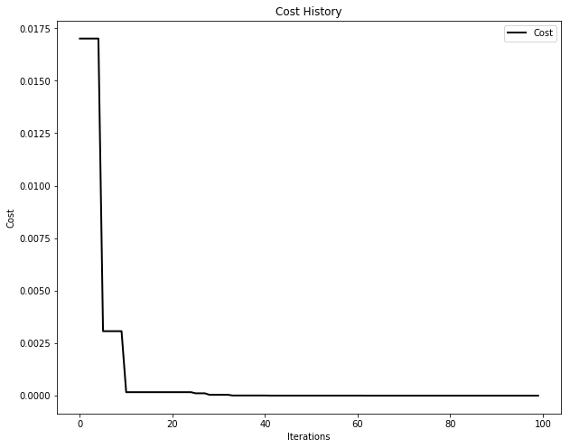

Visualization
=============

PySwarms implements tools for visualizing the behavior of your swarm.
These are built on top of ``matplotlib``, thus rendering charts that are
easy to use and highly-customizable. However, it must be noted that in
order to use the animation capability in PySwarms (and in ``matplotlib``
for that matter), at least one writer tool must be installed. Some
available tools include: \* ffmpeg \* ImageMagick \* MovieWriter (base)

In the following demonstration, the ``ffmpeg`` tool is used. For Linux
and Windows users, it can be installed via:

.. code:: shell

    $ conda install -c conda-forge ffmpeg

.. code:: ipython3

    import sys
    # Change directory to access the pyswarms module
    sys.path.append('../')

.. code:: ipython3

    print('Running on Python version: {}'.format(sys.version))

.. code:: shell

    Running on Python version: 3.6.3 |Anaconda custom (64-bit)| (default, Oct 13 2017, 12:02:49) [GCC 7.2.0]

In this example, we will demonstrate three plotting methods available on
PySwarms: - ``plot_cost_history``: for plotting the cost history of a
swarm given a matrix - ``plot_contour``: for plotting swarm trajectories
of a 2D-swarm in two-dimensional space - ``plot_surface``: for plotting
swarm trajectories of a 2D-swarm in three-dimensional space

.. code:: ipython3

    # Import modules
    import matplotlib.pyplot as plt
    import numpy as np
    from matplotlib import animation, rc
    from IPython.display import HTML
    
    # Import PySwarms
    import pyswarms as ps
    from pyswarms.utils.functions import single_obj as fx
    from pyswarms.utils.plotters import (plot_cost_history, plot_contour, plot_surface)
    
    # Some more magic so that the notebook will reload external python modules;
    # see http://stackoverflow.com/questions/1907993/autoreload-of-modules-in-ipython
    %load_ext autoreload
    %autoreload 2

The first step is to create an optimizer. Here, we're going to use
Global-best PSO to find the minima of a sphere function. As usual, we
simply create an instance of its class ``pyswarms.single.GlobalBestPSO``
by passing the required parameters that we will use. Then, we'll call
the ``optimize()`` method for 100 iterations.

.. code:: ipython3

    options = {'c1':0.5, 'c2':0.3, 'w':0.9}
    optimizer = ps.single.GlobalBestPSO(n_particles=50, dimensions=2, options=options)
    cost, pos = optimizer.optimize(fx.sphere_func, iters=100)

.. parsed-literal::

    INFO:pyswarms.single.global_best:================================
    Optimization finished!
    Final cost: 0.0000
    Best value: [0.00012738838189254011, -0.00011284635020703156]
    

Plotting the cost history
-------------------------

To plot the cost history, we simply obtain the ``cost_history`` from the
``optimizer`` class and pass it to the ``cost_history`` function.
Furthermore, this method also accepts a keyword argument ``**kwargs``
similar to ``matplotlib``. This enables us to further customize various
artists and elements in the plot. In addition, we can obtain the
following histories from the same class: - mean\_neighbor\_history:
average local best history of all neighbors throughout optimization -
mean\_pbest\_history: average personal best of the particles throughout
optimization

.. code:: ipython3

    plot_cost_history(cost_history=optimizer.cost_history)
    plt.show()

Animating swarms
----------------

The ``plotters`` module offers two methods to perform animation,
``plot_contour()`` and ``plot_surface()``. As its name suggests, these
methods plot the particles in a 2-D or 3-D space.

Each animation method returns a ``matplotlib.animation.Animation`` class
that still needs to be animated by a ``Writer`` class (thus
necessitating the installation of a writer module). For the proceeding
examples, we will convert the animations into an HTML5 video. In such
case, we need to invoke some extra methods to do just that.

.. code:: ipython3

    # equivalent to rcParams['animation.html'] = 'html5'
    # See http://louistiao.me/posts/notebooks/save-matplotlib-animations-as-gifs/
    rc('animation', html='html5')

Lastly, it would be nice to add meshes in our swarm to plot the sphere
function. This enables us to visually recognize where the particles are
with respect to our objective function. We can accomplish that using the
``Mesher`` class.

.. code:: ipython3

    from pyswarms.utils.plotters.formatters import Mesher

.. code:: ipython3

    # Initialize mesher with sphere function
    m = Mesher(func=fx.sphere_func)

There are different formatters available in the
``pyswarms.utils.plotters.formatters`` module to customize your plots
and visualizations. Aside from ``Mesher``, there is a ``Designer`` class
for customizing font sizes, figure sizes, etc. and an ``Animator`` class
to set delays and repeats during animation.

Plotting in 2-D space
~~~~~~~~~~~~~~~~~~~~~

We can obtain the swarm's position history using the ``pos_history``
attribute from the ``optimizer`` instance. To plot a 2D-contour, simply
pass this together with the ``Mesher`` to the ``plot_contour()``
function. In addition, we can also mark the global minima of the sphere
function, ``(0,0)``, to visualize the swarm's "target".

.. code:: ipython3

    # Make animation
    animation = plot_contour(pos_history=optimizer.pos_history,
                             mesher=m,
                             mark=(0,0))
    
    # Enables us to view it in a Jupyter notebook
    HTML(animation.to_html5_video())

.. image:: https://i.imgur.com/g7UcOgU.gif

Plotting in 3-D space
~~~~~~~~~~~~~~~~~~~~~

To plot in 3D space, we need a position-fitness matrix with shape
``(iterations, n_particles, 3)``. The first two columns indicate the x-y
position of the particles, while the third column is the fitness of that
given position. You need to set this up on your own, but we have
provided a helper function to compute this automatically

.. code:: ipython3

    # Obtain a position-fitness matrix using the Mesher.compute_history_3d()
    # method. It requires a cost history obtainable from the optimizer class
    pos_history_3d = m.compute_history_3d(optimizer.pos_history)

.. code:: ipython3

    # Make a designer and set the x,y,z limits to (-1,1), (-1,1) and (-0.1,1) respectively
    from pyswarms.utils.plotters.formatters import Designer
    d = Designer(limits=[(-1,1), (-1,1), (-0.1,1)], label=['x-axis', 'y-axis', 'z-axis'])

.. code:: ipython3

    # Make animation
    animation3d = plot_surface(pos_history=pos_history_3d, # Use the cost_history we computed
                               mesher=m, designer=d,       # Customizations
                               mark=(0,0,0))               # Mark minima
    
    # Enables us to view it in a Jupyter notebook
    HTML(animation3d.to_html5_video())

.. image:: https://i.imgur.com/IhbKTIE.gif