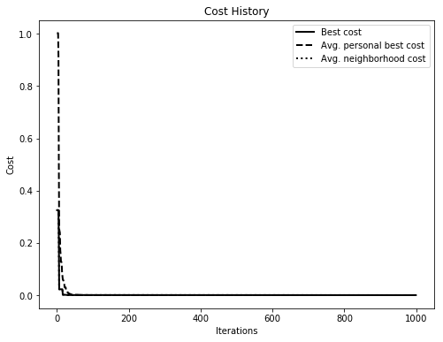
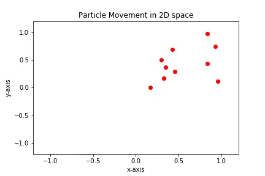
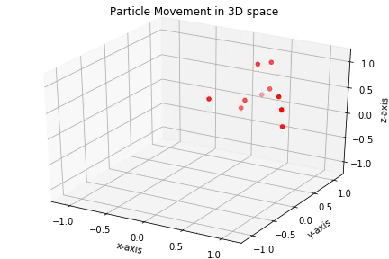

Visualization
=============

PySwarms implements tools for visualizing the behavior of your swarm.
These are built on top of ``matplotlib``, thus rendering charts that are
easy to use and highly-customizable. However, it must be noted that in
order to use the animation capability in PySwarms (and in ``matplotlib``
for that matter), at least one writer tool must be installed. Some
available tools include: \* ffmpeg \* ImageMagick \* MovieWriter (base)

In the following demonstration, the ``ffmpeg`` tool is used. For Linux
and Windows users, it can be installed via:

.. code:: shell

    $ conda install -c conda-forge ffmpeg

First, we need to import the
``pyswarms.utils.environments.PlotEnvironment`` class. This enables us
to use various methods to create animations or plot costs.

.. code-block:: ipython

    # Import modules
    import matplotlib.pyplot as plt
    import numpy as np
    from matplotlib import animation, rc
    from IPython.display import HTML
    
    # Import PySwarms
    import pyswarms as ps
    from pyswarms.utils.functions import single_obj as fx
    from pyswarms.utils.environments import PlotEnvironment
    
    # Some more magic so that the notebook will reload external python modules;
    # see http://stackoverflow.com/questions/1907993/autoreload-of-modules-in-ipython
    %load_ext autoreload
    %autoreload 2

The first step is to create an optimizer. Here, we're going to use
Global-best PSO to find the minima of a sphere function. As usual, we
simply create an instance of its class ``pyswarms.single.GlobalBestPSO``
by passing the required parameters that we will use.

.. code-block:: ipython

    options = {'c1':0.5, 'c2':0.3, 'w':0.9}
    optimizer = ps.single.GlobalBestPSO(n_particles=10, dimensions=3, options=options)

Initializing the ``PlotEnvironment``
------------------------------------

Think of the ``PlotEnvironment`` as a container in which various
plotting methods can be called. In order to create an instance of this
class, we need to pass the optimizer object, the objective function, and
the number of iterations needed. The ``PlotEnvironment`` will then
simulate these parameters so as to build the plots.

.. code-block:: ipython

    plt_env = PlotEnvironment(optimizer, fx.sphere_func, 1000)

Plotting the cost
-----------------

To plot the cost, we simply need to call the ``plot_cost()`` function.
There are pre-set defaults in this method already, but we can customize
by passing various arguments into it such as figure size, title, x- and
y-labels and etc. Furthermore, this method also accepts a keyword
argument ``**kwargs`` similar to ``matplotlib``. This enables us to
further customize various artists and elements in the plot.

For now, let's stick with the default one. We'll just call the
``plot_cost()`` and ``show()`` it.

.. code-block:: ipython

    plt_env.plot_cost(figsize=(8,6));
    plt.show()

Animating swarms
----------------

The ``PlotEnvironment()`` offers two methods to perform animation,
``plot_particles2D()`` and ``plot_particles3D()``. As its name suggests,
these methods plot the particles in a 2-D or 3-D space. You can choose
which dimensions will be plotted using the ``index`` argument, but the
default takes the first 2 (or first three in 3D) indices of your swarm
dimension.

Each animation method returns a ``matplotlib.animation.Animation`` class
that still needs to be animated by a ``Writer`` class (thus
necessitating the installation of a writer module). For the proceeding
examples, we will convert the animations into an HTML5 video. In such
case, we need to invoke some extra methods to do just that.

.. code-block:: ipython

    # equivalent to rcParams['animation.html'] = 'html5'
    # See http://louistiao.me/posts/notebooks/save-matplotlib-animations-as-gifs/
    rc('animation', html='html5')

Plotting in 2-D space
~~~~~~~~~~~~~~~~~~~~~

.. code-block:: ipython

    HTML(plt_env.plot_particles2D(limits=((-1.2,1.2),(-1.2,1.2))).to_html5_video())

Plotting in 3-D space
~~~~~~~~~~~~~~~~~~~~~

.. code:: ipython3

    HTML(plt_env.plot_particles3D(limits=((-1.2,1.2),(-1.2,1.2),(-1.2,1.2))).to_html5_video())

